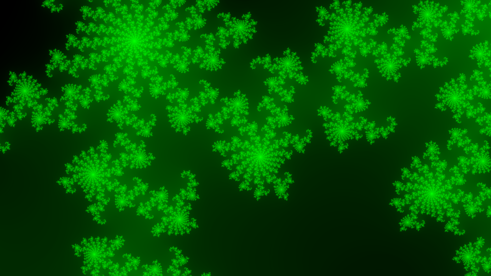

# Fractal Viewer (SDL2)

A real-time interactive Mandelbrot and Julia set renderer using SDL2, with color customization, zooming, animation, and high-quality screenshot capture.
Currently supports the Mandelbrot set and Julia sets (try and uncover the interaction!).

## Features

- Render Mandelbrot and Julia sets in real-time.
- Zoom in/out with precision.
- Mouse control for navigating and exploring the fractal space.
- Toggle animation of Julia sets.
- Capture high-resolution screenshots.
- Fine-grained control over visual appearance via:

  - Exponential color bias adjustment.
  - Max escape step tweaking.
  - Custom color map.

- Smooth animations via rotating complex parameter `C` in the Julia set.

---

## Keybindings

| Key         | Action                                                                 |
| ----------- | ---------------------------------------------------------------------- |
| `ESC`       | Exit the program                                                       |
| `s`         | Save a high-resolution screenshot                                      |
| `f`         | Toggle the color of "in the set" pixels (black or natural progression) |
| `m`         | Toggle mouse control for adjusting the Julia parameter `C`             |
| `i`         | Zoom **in** at mouse location and reset mouse to center                |
| `o`         | Zoom **out** from mouse location                                       |
| `n`         | Cycle to the next fractal variant                                      |
| `1`         | Switch to Julia set                                                    |
| `2`         | Switch to Mandelbrot set                                               |
| `,` / `.`   | Decrease / increase exponential color bias                             |
| `<` / `>`   | Decrease / increase max escape steps                                   |
| Mouse click | Center view on mouse location                                          |
| `a`         | Toggle animation for the Julia set                                     |

---

## Visual Tuning Tips

- If the image is **too dark or too bright**, use `,` and `.` to adjust the **exponential color bias**. This alters how quickly color intensity grows, making subtle structures more visible.
- If you see large black blobs that don’t resolve detail, increase the **maximum escape steps** using `>`.

- For best screenshots:

  - Adjust colors and zoom level.
  - Freeze animation (`a`) and lock mouse input (`m`).
  - Then press `s` to save a snapshot.

---

## Build & Run

### Prerequisites

- **SDL2** and **SDL2_image** (install via Homebrew: `brew install sdl2 sdl2_image`)
- **OpenMP** (for parallel rendering)
- C compiler supporting OpenMP (`gcc` or `clang` on macOS with `libomp`)

### Build Instructions (macOS/Homebrew)

```bash
make build
```

### Run the Program

```bash
make run
```

### Clean Build Files

```bash
make clean
```

> **Note:** This Makefile assumes you're using **Homebrew** and an **Apple Silicon (M1/M2)** or Intel Mac with libraries installed in `/opt/homebrew/`.

If you’re on another system, you may need to adjust the `-I` and `-L` paths in the `Makefile`.

---

## Screenshots

## 📸 Screenshots

### Double Pass Rendering


### Electric


### Event Horizon


### Lilypads



### Julia Flower


### Mandelbrot Spiral


### Mini Mandelbrot


### Mouth of the Mandelbrot


### Pink Spirals


### Fire


### Twisters


### Thorns


### Spider Fractal


### Spirals


### Super Zoomed Mandelbrot


### The Limit of the Doubles


### The Probe


### Tree of Life


### Web


### Zoomed Black and White


### Zoomed Flower Spiral


---

## License

MIT License
